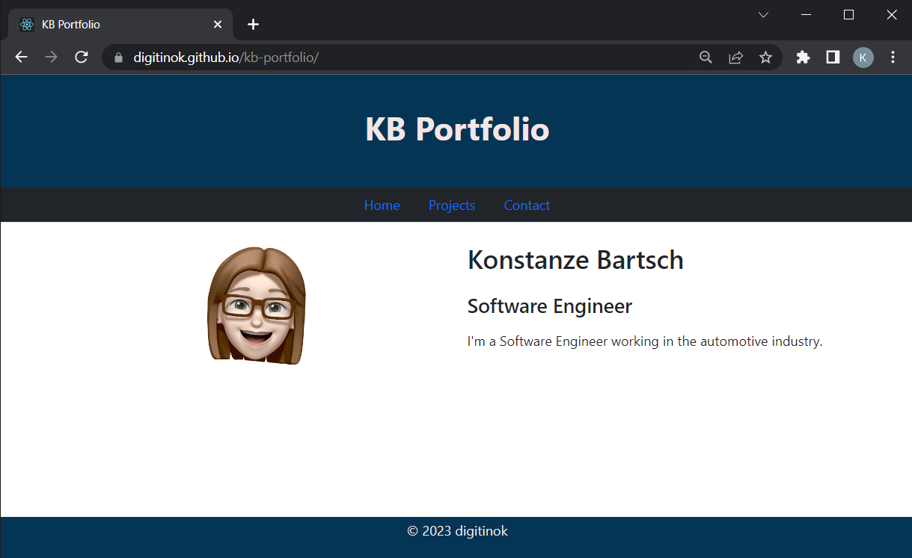

# KB Portfolio

## Table of Contents

1. [Description](#description)
2. [Installation](#installation)
3. [Usage](#usage)
4. [License](#license)
5. [Contributing](#contributing)
6. [Tests](#tests)
7. [Questions](#questions)

## Description

This is my personal portfolio, showcasing all my projects.

### Repository

https://github.com/digitinok/kb-portfolio

### Deployed Webpage

https://digitinok.github.io/kb-portfolio/

## Installation

The portfolio is created with react.  Just run `npm install` to install all the relevant dependencies from the `package.json` file.

## Usage

After the website is build running `npm run build`, it is deployed so anyone interested in the projects I worked on can view the portfolio webpage in the web browser.

Screenshot of Portfolio Webpage

## License

The project uses the MIT License. Please check the license file in the repository for further information about what you are allowed to do.

## Contributing

No, this is personal.

## Tests

The website is currently tested manually.

## Questions

You can find us on GitHub: https://github.com/digitinok.    
  
